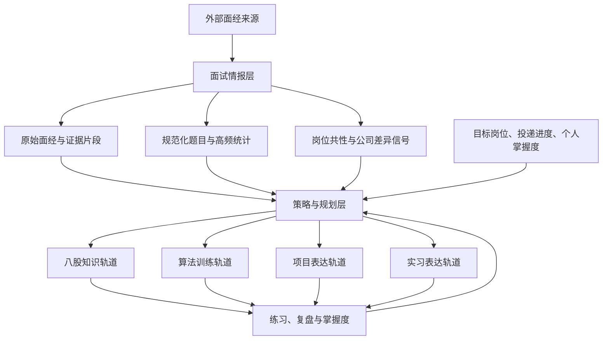
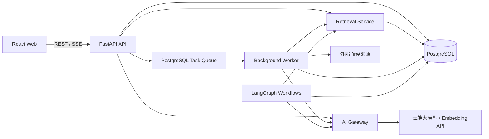
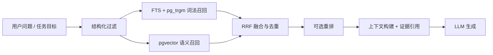

# 技术架构

## 1. 架构结论

采用 **以 PostgreSQL 为数据核心的前后端分离模块化单体**：

- 面经不是与其他模块平级的内容模块，而是全局的“面试情报源”
- PostgreSQL 保存业务数据、面经原文、结构化抽取结果、检索索引、向量和任务状态
- `PostgreSQL FTS / pg_trgm + pgvector` 组成混合检索，不在 grep 和 RAG 之间二选一
- 批量抽取、统计和计划生成采用确定性工作流；只在需要动态决策、多轮交互的场景使用 Agent
- LangGraph 选择性用于模拟面试和经历深挖，不作为整个后端的基础框架
- MVP 不引入微服务、Redis、Celery、独立向量数据库或图数据库
- MVP 不做面向用户的定时任务；长任务由页面/API 主动触发，Worker 负责执行、失败重试和后续聚合

该方案既满足个人本地使用，也保留后续部署和扩展空间。

## 2. 重新定义模块关系

五个原始模块应重构为三层，而不是五个平级入口。



### 2.1 面试情报层

面经类似“历年试卷集”。它负责回答：

- 最近真实面试在考什么
- 哪些问题高频出现
- 后端和 Agent 岗位分别关注哪些能力
- 不同轮次的考察重点是什么
- 某公司的少量差异化要求是什么
- 每个结论来自哪些面经，时间和可信度如何

面经层的输出不是一篇篇 AI 摘要，而是可复用的情报数据：

- 规范化面试题
- 技能主题和知识点
- 题目出现记录
- 时间、公司、岗位、轮次等维度
- 追问链和难度
- 证据片段与来源链接
- 高频趋势和公司差异信号

### 2.2 策略与规划层

策略层同时消费外部需求和个人状态：

- 外部需求：面经情报产生的考察频率、近期趋势、目标相关性
- 个人状态：掌握度、错题、项目证据、实习证据、剩余时间
- 求职状态：目标岗位和当前投递流程；投递阶段只在临近面试时作为弱信号

任务优先级由规则先计算，模型只负责解释和调整：

```text
priority =
  demand_score
  * weakness_score
  * recency_weight
  * role_relevance
  * stage_urgency
  / estimated_effort
```

默认以岗位共性为主，公司个性为辅。建议初始权重：

- 公共岗位画像：80%
- 当前重点公司差异：20%

权重可以随投递进入面试阶段临时调整，但不为每家公司复制一整套学习计划。实现时应将投递阶段影响限制为临近面试时的弱信号，具体阈值由 AI 根据数据模型决定。

### 2.3 四条准备轨道

- 八股：将高频主题映射到外部优质资料、知识卡片、追问训练和掌握度
- 算法：将面经题型映射到 LeetCode 等外部题目，应用内维护题单、状态和错题复盘
- 项目：根据岗位考点检查已有项目能否提供证据，生成表达版本和追问树
- 实习：根据岗位考点整理 STAR、量化结果、职责边界和追问树

八股和算法偏“知识与技能训练”，项目和实习偏“个人证据与表达训练”。四者都由面试情报驱动，但数据模型和交互不能强行统一。

## 3. 系统拓扑



### 3.1 前端

- `React + TypeScript + Vite`
- `Ant Design`：表格、表单、抽屉、管理页和状态流转
- `TanStack Query`：服务端状态、缓存、轮询和失效管理
- `Zustand`：仅保存少量跨页面客户端状态
- `ECharts`：高频趋势、学习进度、token 使用统计
- `SSE`：显示长时间 AI 生成和后台处理进度

### 3.2 后端

- `FastAPI`
- `Pydantic v2`：API 和 AI 结构化输出契约
- `SQLAlchemy 2 + psycopg 3`
- `Alembic`
- `httpx + HTML parser`：静态页面优先
- `Playwright`：只作为动态页面抓取的后备方案
- 云端模型的 OpenAI-compatible SDK
- `LangGraph`：仅用于明确的有状态 Agent 工作流

### 3.3 后台任务

采用“PostgreSQL 任务表 + 独立 Worker 进程”：

- 页面/API 主动创建抓取、分析、聚合和计划生成任务
- Worker 使用 `FOR UPDATE SKIP LOCKED` 领取任务
- 每个任务保存状态、重试次数、下次执行时间和错误信息
- API 进程不直接执行长时间爬取、embedding 或批量总结
- `next_run_at` 只用于失败重试和任务退避，不代表产品提供定时采集或定时推送

MVP 不使用 Redis/Celery。单机上运行一个 Worker 即可，后续可以无缝增加 Worker 数量。

## 4. PostgreSQL 数据架构

PostgreSQL 是唯一业务事实源。原文、清洗结果、结构化情报和用户数据都可追溯。

### 4.1 必要扩展

- `vector`：语义向量检索
- `pg_trgm`：术语、短文本、错别字和相似标题匹配

中文词法检索在应用侧先分词，将结果写入 `search_tokens`，再生成 `tsvector`。这样避免 MVP 强依赖部署复杂的中文 PostgreSQL 分词扩展。

### 4.2 核心表组

#### 情报采集

- `sources`：来源站点、抓取策略、可信度和启停状态
- `crawl_jobs`：待执行任务、状态、重试和调度信息
- `crawl_runs`：每次抓取执行记录
- `interview_documents`：URL、原文、清洗正文、内容哈希、发布时间、抓取时间
- `document_chunks`：可检索片段、位置信息、词法索引
- `document_embeddings`：片段向量、模型和版本
- `extraction_runs`：抽取 Schema 版本、prompt 哈希、结构化结果和校验状态

#### 结构化情报

- `companies`
- `role_profiles`：后端、Agent 等公共岗位画像
- `interview_rounds`
- `topics`：Java、Redis、Agent Memory、RAG Evaluation 等主题
- `canonical_questions`：归一化后的题目
- `question_occurrences`：某题在某篇面经、某轮次的出现记录
- `question_topic_links`
- `evidence_spans`：抽取结论对应的原文片段
- `frequency_snapshots`：按时间窗口、岗位、公司和轮次聚合的频率快照

#### 个人准备

- `target_profiles`：当前目标方向、时间投入和公共/公司权重
- `applications`：公司、岗位、链接、阶段、下一步和时间
- `study_plans`
- `study_tasks`
- `topic_mastery`
- `algorithm_items`、`algorithm_attempts`
- `knowledge_cards`、`knowledge_reviews`
- `projects`、`project_versions`、`project_evidence`
- `internships`、`internship_versions`、`internship_evidence`

#### AI 与 Agent

- `prompt_scenarios`：少量关键 AI 场景
- `prompt_templates`：当前模板、参数和模型配置
- `ai_call_logs`：模块、场景、模型、token、耗时、费用估算、prompt 哈希、trace ID
- `agent_runs`：工作流类型、状态、输入输出摘要
- LangGraph checkpoint 表：由 `langgraph-checkpoint-postgres` 管理

Checkpoint 只保存可恢复的运行时状态，并配置保留期限；确认后的计划、评分和经历版本必须写回业务表。LangGraph checkpoint 不是长期业务事实源。

### 4.3 原文与向量的持久化

- 面经原文在 `interview_documents.raw_content` 中保留
- 清洗正文单独保存，避免重新解析原始 HTML
- 使用 URL 规范化结果和内容哈希进行幂等去重
- 每个 chunk 保留文档 ID、字符区间或 DOM 定位，保证回答可以回到证据
- embedding 必须记录模型名和版本；更换向量维度时新建索引版本并后台重建

MVP 数据量下先使用 pgvector 精确检索。只有 chunk 达到数万级并确认延迟问题后，再增加 HNSW 索引，避免过早牺牲召回率和增加运维复杂度。

## 5. grep、词法检索与 RAG 的取舍

### 5.1 结论

它们不是同一层能力：

- `rg/grep`：开发和排障时搜索本地文件，或对尚未入库的临时原文做精确匹配
- SQL/词法检索：产品运行时查专有名词、公司名、技术名、题号和精确短语
- 向量检索：查措辞不同但语义相近的问题
- RAG：取回证据后，让模型完成总结、解释、计划或模拟追问

产品运行时不把 grep 当知识库，也不让 RAG 替代结构化查询。

### 5.2 混合检索流程



检索顺序：

1. 先按岗位、公司、时间、轮次、来源质量做结构化过滤
2. 词法检索和向量检索各取候选
3. 使用 Reciprocal Rank Fusion 合并排名，避免直接混加不同量纲分数
4. 高价值场景可增加一次轻量重排
5. 组装去重后的证据片段，并保留来源 ID
6. 生成结果必须返回引用；无充分证据时明确标记

### 5.3 高频题不能由 RAG 直接生成

高频题应经过以下链路：

1. 从面经抽取题目出现记录
2. 通过词法和向量召回规范题候选
3. 规则优先、模型辅助判断是否为同一道题
4. 写入 `canonical_questions` 和 `question_occurrences`
5. 按文档、轮次去重后使用 SQL 聚合
6. 生成 30/90/180 天及岗位、公司维度的频率快照

需要提供“合并/拆分题目”的人工修正入口。AI 负责抽取和归一化辅助，数据库负责统计事实。

### 5.4 何时不使用 RAG

- 展示原始面经列表
- 查询投递记录
- 统计某题出现次数
- 查询算法题状态
- 查看已有项目版本
- 精确查找某个技术名词

这些场景直接使用数据库查询，减少延迟、token 和幻觉。

## 6. AI、LangChain、LangGraph 与 ReAct

### 6.1 选型结论

- 简单抽取、总结、改写：自有 `AI Gateway + Pydantic Schema`
- 模型与工具的基础适配：按需使用 `langchain-core`，不让业务模型依赖 LangChain Document
- 有状态、可暂停、可恢复的多步流程：使用 LangGraph
- ReAct：只用于工具选择无法预先确定的交互场景

业务服务依赖自有接口，例如 `Retriever`、`ModelGateway`、`PromptRegistry`。LangChain/LangGraph 只能出现在基础设施和工作流层，避免框架对象渗入数据库模型和 API。

### 6.2 不采用“全局 Agent”

以下流程应保持确定性：

- 爬取、清洗、去重、分块和入库
- 面试题结构化抽取
- embedding 生成
- 高频统计
- token 计费
- 投递状态流转
- 基础 RAG 问答

这些流程使用固定步骤、结构化输出、重试和校验，比 ReAct 更稳定、更便宜、更容易测试。

### 6.3 适合 LangGraph 的场景

#### 模拟面试 Agent

状态包括目标岗位、当前题目、追问深度、已暴露薄弱点、证据引用和评分。流程可在用户回答后分支：

```text
选择题目 -> 提问 -> 等待用户回答 -> 评分
-> 追问 / 提示 / 切题 -> 总结薄弱点 -> 更新掌握度
```

它需要多轮状态、暂停恢复和人工参与，LangGraph 的 checkpoint 与 interrupt 有实际价值。

#### 项目/实习深挖 Agent

Agent 可使用：

- 读取用户项目或实习资料
- 检索相关面经考点
- 检查缺失事实
- 向用户询问，不允许自行编造
- 生成 STAR、简历版本和追问树
- 由用户确认后保存版本

#### 面试前冲刺包

默认先使用固定工作流。只有当证据不足、多个目标冲突或需要主动补查时，才进入受限 Agent 分支。

### 6.4 ReAct 的约束

ReAct 只开放白名单工具：

- `search_interview_intelligence`
- `get_application_context`
- `get_mastery_profile`
- `get_project_or_internship`
- `save_draft`

同时设置：

- 最大步骤数
- 单次 token 和费用预算
- 工具超时
- 每步结构化日志
- 写操作前用户确认
- 不暴露模型隐藏推理，只保存决策摘要、工具输入输出和结果

### 6.5 Prompt 管理

管理端只配置少数关键场景：

- 面经结构化抽取
- 面经总结
- 题目归一化辅助
- 项目包装
- 实习包装
- 备战计划
- 模拟面试评分

代码负责：

- 输入输出 Schema
- 工具权限
- 工作流拓扑
- 安全规则
- 重试与降级

管理端负责：

- system/task 指令片段
- 可替换变量
- temperature、max tokens 等少量参数
- 启用的模型配置

不做发布和回滚系统。为保证可追溯，每次调用在 `ai_call_logs` 中保存 prompt 哈希和实际参数。

## 7. 关键处理链路

### 7.1 面经入库

```text
发现 URL
-> 规范化 URL 与查重
-> 抓取原文
-> 清洗正文
-> 内容哈希去重
-> 结构化抽取
-> 分块与分词
-> 生成 embedding
-> 题目归一化
-> 更新频率快照
-> 可检索
```

每一步都是幂等任务，可单独重试。失败不会覆盖已经成功的原始数据。

### 7.2 策略生成

```text
读取目标与投递阶段（仅在临近面试时作为弱信号）
-> 读取近期岗位需求画像
-> 读取个人掌握度和经历证据
-> 规则计算优先级
-> 检索相关面经证据
-> LLM 生成可读计划
-> 规则校验时间预算和任务重复
-> 保存计划与任务
```

### 7.3 项目/实习包装

```text
读取用户事实
-> 检索岗位高频考点
-> 建立“考点 - 个人证据”映射
-> 标记缺失事实并询问用户
-> 生成表达草稿和追问树
-> 用户确认
-> 保存新版本
```

系统只包装真实经历，不生成不存在的指标、职责或技术方案。

## 8. 推荐代码结构

```text
study_for_job/
  README.md
  docs/
    product-overview.md
    tech-architecture.md
  frontend/
    src/
      app/
      components/
      features/
        dashboard/
        intelligence/
        applications/
        planning/
        knowledge/
        algorithms/
        projects/
        internships/
        admin/
      services/
      store/
  backend/
    app/
      api/
      core/
      db/
      domains/
        intelligence/
        applications/
        planning/
        learning/
        experience/
      retrieval/
      ai/
        gateway/
        prompts/
        schemas/
      agents/
        interview_simulation/
        experience_coach/
      crawlers/
      jobs/
      observability/
  migrations/
  tests/
  docker-compose.yml
```

模块通过服务接口和 ID 交互，不直接跨域操作 ORM 模型。

## 9. 本地与部署方案

本地使用 Docker Compose：

- `frontend`
- `api`
- `worker`
- `postgres`，预装 pgvector

不单独部署 Scheduler。页面/API 创建任务，Worker 与 API 进程分离执行长任务；后续部署时可将 PostgreSQL 换为托管服务，应用层不改数据接口。

备份以 `pg_dump` 为主。因为是单用户免登录应用，部署到公网前必须补充身份认证和 HTTPS，不能沿用本地免登录配置。

## 10. 实施顺序

### T001 已实现骨架：本地投递闭环

- `frontend` 使用 Vite + React，业务读写全部经 `/api`，浏览器不维护持久化事实副本。
- `backend/app/main.py` 提供 FastAPI 访问层；`/api/health` 使用 `SELECT 1` 验证 API 到 PostgreSQL 的连通性。
- `migrations/001_initial.sql` 创建 `target_profiles` 与 `applications`，阶段由 CHECK 约束限定，同一 `(company, role)` 由唯一约束去重。
- `backend/app/config.py` 按 `POSTGRES_HOST/PORT/USER/PASSWORD/DB` 构造带密码转义的 `postgresql+psycopg` DSN，同时兼容 `DATABASE_URL`；`backend/app/db.py` 统一管理 SQLAlchemy Engine、连接池、`pool_pre_ping`、UTC 时区和 session 提交/回滚。
- `backend/app/models.py` 为 `target_profiles` 与 `applications` 提供与迁移一致的 ORM 表模型；API 通过统一 session 访问，避免多个连接管理实现并存。
- `docker-compose.yml` 编排 postgres、api、frontend，迁移由 Postgres 初始化目录加载。
- 未实现 AI Gateway、Worker 或面经情报处理，仅保留可在 `backend/app` 下扩展的 API 边界。

#### 本地开发数据与使用数据隔离

- 同一个 PostgreSQL 16 实例维护 `study_for_job_dev` 和 `study_for_job` 两个业务数据库，避免在正式使用前依赖手工清理测试事实，也不引入第二种存储技术。
- `migrations/001_initial.sql` 是两个数据库共同的结构事实源；`database/seeds/development.sql` 仅由开发库初始化脚本执行，并通过唯一键与条件插入保持幂等。
- 默认 Compose 连接开发库，`docker-compose.usage.yml` 只覆盖 API 的环境标识和数据库名。前端仍只通过 `/api` 访问当前数据库，不感知也不缓存另一套持久化事实。
- `/api/health` 返回 `environment` 和 `database_name`，用于人工确认当前写入边界，避免在两个环境间静默写错数据库。

### T003 已实现：可替换 AI Gateway 与调用账本

- 业务层依赖自有 `AiGateway`、`AiProvider`、`PromptStore` 与 `CallLogStore` 契约；当前 provider 为确定性 fake 和由环境配置的 DeepSeek OpenAI-compatible 适配器。
- prompt 读取、远程调用、日志写入分段执行，网络 I/O 不持有数据库事务；无论成功或失败都以 trace ID 关联脱敏调用事实。
- `prompt_scenarios`、`prompt_templates` 只开放三个关键场景和少量参数；变量白名单、Schema、安全规则、工具权限和工作流继续由代码控制。
- `ai_call_logs` 支持按模块/场景/时间统计 token、状态和耗时，保存实际 prompt 哈希但不保存 prompt/响应正文或凭据。
- 编号 SQL 由 API 启动迁移器在 advisory lock 内增量应用并校验 checksum，覆盖已有数据卷；全新开发库和使用库仍共用同一迁移事实源。
- 桌面 AI 管理页提供配置编辑、30 天聚合、最近 trace 和固定诊断；不提供自由文本聊天或 provider 管理。
- 实现与验证细节见 [AI Gateway 与调用账本](implementation/ai-gateway.md)。

### T004 已实现：PostgreSQL 任务队列与独立 Worker

- `jobs` 保存任务当前事实，`job_attempts` 保存每次租约/执行事实；状态为 `queued | running | retry_wait | succeeded | failed`。
- Worker 在短事务内使用 `FOR UPDATE SKIP LOCKED` 领取，事务外执行注册处理器，并以 lease token 条件写回；心跳续租、过期恢复和迟到结果拒绝共同提供至少一次执行语义。
- 数据库级部分唯一索引处理幂等创建；可重试失败采用有界指数退避，永久失败、最大尝试与租约耗尽均有明确终态和原因。
- Compose 独立运行 API 与 Worker，development/usage overlay 同时切换两者数据库；受限诊断不接受任意 URL、prompt、正文、代码或用户定时时间。
- 实现与验证细节见 [PostgreSQL 任务队列与 Worker](implementation/job-queue-worker.md)。

### 阶段一：数据底座与投递闭环

- PostgreSQL、迁移和基础领域表
- 投递记录
- 目标画像
- AI Gateway、prompt 配置、token 日志
- PostgreSQL 任务队列与 Worker

### 阶段二：面试情报闭环

- 首批来源适配器
- 原文持久化和去重
- 结构化抽取
- 题目归一化
- FTS / pg_trgm + pgvector 混合检索
- 高频统计和证据回链

### 阶段三：四条准备轨道

- 情报驱动的八股知识地图
- 外部算法平台题单与错题复盘
- 项目和实习的证据映射与版本管理
- 随机抽题练习
- 规则优先、页面主动触发的准备评估报告，并可生成每日/每周/面试前任务建议

### 阶段四：Agent 场景

- 多轮模拟面试 Agent（与随机抽题练习分开）
- 项目/实习深挖 Agent
- LangGraph PostgreSQL checkpoint
- Agent 运行预算和评估集

先验证情报数据质量，再做 Agent。Agent 的效果上限取决于前面的抽取、归一化和检索质量。

## 11. 导出约定

MVP 提供两类导出：

- Markdown：便于个人阅读、复习和分享
- JSON：保留完整结构，便于备份、迁移和后续由 AI 处理

导出由页面主动触发，不引入自动备份任务。具体字段和文件组织由实现阶段根据数据模型确定。

## 12. 验收指标

- 同一 URL 和相同内容重复抓取不会产生重复面经
- 高频题的每个计数都能回到具体面经证据
- 混合检索能同时命中精确术语和不同措辞的同义问题
- 策略任务能说明其来源、目标和优先级原因
- 项目/实习内容中没有未经用户确认的事实
- 每次 AI 调用都可按模块、场景、模型统计 token
- Agent 中断后可以从 PostgreSQL checkpoint 恢复
- 不调用 LLM 的场景不会产生额外 token 消耗

## 13. 参考资料

- [PostgreSQL Full Text Search](https://www.postgresql.org/docs/current/textsearch.html)
- [PostgreSQL pg_trgm](https://www.postgresql.org/docs/current/pgtrgm.html)
- [pgvector](https://github.com/pgvector/pgvector)
- [LangChain Retrieval and RAG architectures](https://docs.langchain.com/oss/python/langchain/retrieval)
- [LangGraph overview](https://docs.langchain.com/oss/python/langgraph/overview)
- [LangGraph persistence](https://docs.langchain.com/oss/python/langgraph/persistence)
- [ReAct paper](https://arxiv.org/abs/2210.03629)
